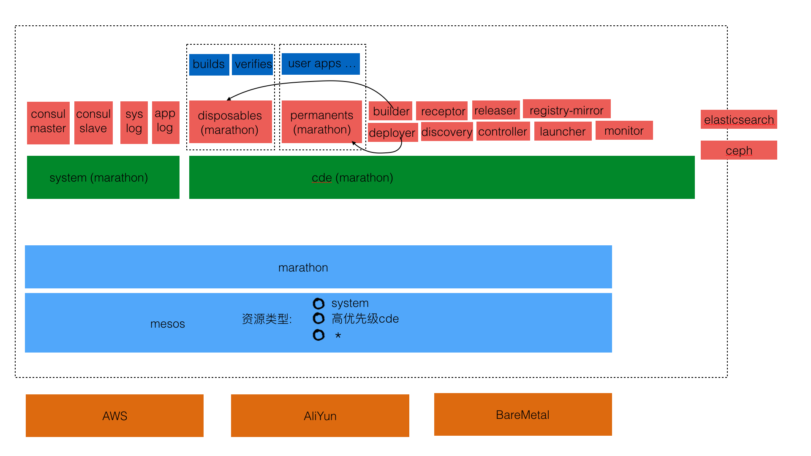

# CDE PAAS 

## 系统部署架构


### Requirements
1. Ansible 2.0.0

```
  brew install ansible
```
	
### <a name="extravars">基础配置文件</a>

```
{
  "ansible_user": "vagrant",
  "zookeeper_hosts": [
    {
      "address": "192.168.50.201",
      "id": 1
    }
  ],
  "consul_servers": [
    "192.168.50.201"
  ],
  "consul_bootstrap_expect": 1,
  "mesos_quorum": 1,
  "elasticsearch_masters": [
    "192.168.50.201"
  ],
  "java": "oracle-java8-installer",
  "marathon_env_java_opts": "-Xmx256m",
  "ipaddr": "{{ansible_eth1.ipv4.address}}",
  "ceph_stable": "true",
  "journal_collocation": "true",
  "journal_size": 100,
  "monitor_interface": "eth1",
  "cluster_network": "192.168.50.0/24",
  "public_network": "192.168.50.0/24",
  "devices": [
    "/dev/sdb"
  ],
  "os_tuning_params": [
    {
      "name": "kernel.pid_max",
      "value": 4194303
    },
    {
      "name": "fs.file-max",
      "value": 26234859
    }
  ],
  "control_hostname": "192.168.50.101"
}
```
上面的json文件描述了集群里的一些常用的配置，可以进行适当的更改. 其中具体配置项的意思如下表所示:

|字段(以jsonpath的方式描述)|说明|参数值|备注|
|---|---|---|---|
|ansible_user|这个值用来设置ansible部署的时候采用的登陆用户|ubuntu/vagrant| |
|zookeeper_hosts|这个用来配置zookeeper的集群的结构,并且mesos master和marathon需要依赖这个变量来进行ha|[{"address":"xxx", "id":"1"}]| zookeeper的内网IP和对应机器的ID|
|consul_servers|consul master机器IP列表|["ip1", "ip2"]||
|consul_bootstrap_expect|当consul server台数达到多少台的时候，进行master的选举|一般等于consul server 的数量||
|mesos_quorum|quorum是举行投票的法定最低人数|floor(master count /2+1)|总是mesos master 数量一般多一，mesos master的数量为奇数|
|elasticsearch_masters|elasticsearch 的主控节点|master的ip数组||
| java |java在ubuntu下的软件包名|oracle-java8-installer|||
| marathon_env_java_opts| marathon 的java 的虚拟机配置|-Xmx521m||
|ipaddr|机器的ip|当使用aws机器的时候，只有一张网卡，使用{{ansible_eth0.ipv4.address}}，当使用vagrant的时候有两张网卡，eth0是只能被host和vm通信的网卡，所以使用{{ansible_eth1.ipv4.address}}||
| ceph_stable |是否使用ceph的stable version|true/false||
|monitor_interface|ceph monitor监听的网络接口|当使用aws机器的时候，只有一张网卡，使用eth0，当使用vagrant的时候有两张网卡，"eth0"是只能被host和vm通信的网卡，所以使用"eth1"|
|cluster_network||||
|public_network||||
|devices|ceph osd 用来放置数据的单独的磁盘名|在vagrant里面单独加入的磁盘以sd[b,c,d...]的形式存在，所以vagrant可以使用的值为：["/dev/sdb"],使用aws单独添加的磁盘以xvd[b,c,d..]方式存在所以可以使用的值为["/dev/xvdb"]||
| control_hostname |flocker control的机器ip|ip|参见host文件里的ip|


### Local env
1. VirtualBox latest
2. Vagrant 1.5 or later

	```
	brew install cask
	brew cask install vagrant
	vagrant plugin install vagrant-hostmanager
	```
3. Startup

	```
	vagrant up
	```
4. 准备host文件
	在项目的根目录下，有两个示例的host配置文件，```local_standalone```, ```local_ha```, 分别为本地的单机方案，和本地的高可用方案。可以使用根据自己的需要进行相应的修改
5. 准备相应的extravars.json 文件
    根据生成的infrastructure.json 来准备相应的extravars.json 文件,具体参照<a href="#extravars">基础配置文件</a>
6. 获取依赖的ansible role
	
	```
	ansible-galaxy install -r playbooks/roles.yml -p playbooks/roles --force
	```	
7. 基础环境部署

	```
	ansible-playbook --extra-vars="@extravars_standlone.json" --connection=ssh --timeout=30 --limit='all' --inventory-file=hosts_standalone playbooks/master.yml
	ansible-playbook --extra-vars="@extravars_standlone.json" --connection=ssh --timeout=30 --limit='all' --inventory-file=hosts_standalone playbooks/elasticsearch.yml
	ansible-playbook --extra-vars="@extravars_standlone.json" --connection=ssh --timeout=30 --limit='all' --inventory-file=hosts_standalone playbooks/slave.yml
	ansible-playbook --extra-vars="@extravars_standlone.json" --connection=ssh --timeout=30 --limit='all' --inventory-file=hosts_standalone playbooks/ceph.yml
	ansible-playbook --extra-vars="@extravars_standlone.json" --connection=ssh --timeout=30 --limit='all' --inventory-file=hosts_standalone playbooks/flocker-agent.yml
	ansible-playbook --extra-vars="@extravars_standlone.json" --connection=ssh --timeout=30 --limit='all' --inventory-file=hosts_standalone playbooks/elasticsearch.yml
	ansible-playbook --extra-vars="@extravars_standlone.json" --connection=ssh --timeout=30 --limit='all' --inventory-file=hosts_standalone playbooks/flocker-control.yml
	```

### AWS
1. install aws client and depends tools
	
	```
    brew install awscli
    brew install jq
	```
2. config aws client

	```
	aws configure
	```
3. 配置aws机器以及类型

	```
	vim iaas/aws/customization.json
	```
	更改相应的变量配置
4. 初始化aws机器

	```
    ./provision.sh cde
	```
5. 准备aws hosts 文件
   在运行过```./provision.sh cde```之后,会在iaas/aws/目录下生成当前基础结构的ip,文件名为```infrastructure.json```,根据机器的IP来准备相应的hosts文件,可以参考```hosts_ha```进行相应的准备
6. 准备相应的extravars.json 文件
    根据生成的infrastructure.json 来准备相应的extravars.json 文件,具体参照<a href="#extravars">基础配置文件</a>
7. 获取依赖的ansible role
	
	```
	ansible-galaxy install -r playbooks/roles.yml -p playbooks/roles --force
	```
8. 基础环境部署

	```
	ansible-playbook --extra-vars="@extravars_ha.json" --connection=ssh --timeout=30 --limit='all' --inventory-file=hosts_ha playbooks/master.yml
	ansible-playbook --extra-vars="@extravars_ha.json" --connection=ssh --timeout=30 --limit='all' --inventory-file=hosts_ha playbooks/slave.yml
	ansible-playbook --extra-vars="@extravars_ha.json" --connection=ssh --timeout=30 --limit='all' --inventory-file=hosts_ha playbooks/elasticsearch.yml
	ansible-playbook --extra-vars="@extravars_ha.json" --connection=ssh --timeout=30 --limit='all' --inventory-file=hosts_ha playbooks/ceph.yml
	ansible-playbook --extra-vars="@extravars_ha.json" --connection=ssh --timeout=30 --limit='all' --inventory-file=hosts_ha playbooks/flocker-agent.yml
	ansible-playbook --extra-vars="@extravars_ha.json" --connection=ssh --timeout=30 --limit='all' --inventory-file=hosts_ha playbooks/flocker-control.yml
	```
9. 准备相应的desktop 用来访问相应的管理界面
	在aws开一台服务器，然后配置desktop，然后访问管理界面
	配置desktop
	
	```
	sudo vim /etc/ssh/sshd_config # edit line "PasswordAuthentication" to yes
	sudo /etc/init.d/ssh restart
	sudo apt-get update
	sudo apt-get install ubuntu-desktop
	sudo apt-get install vnc4server
	vncserver

	vncserver -kill :1
	
	vim awsgui/.vnc/xstartup
   ``` 
   Then hit the Insert key, scroll around the text file with the keyboard arrows, and delete the pound (#) sign from the beginning of the two lines under the line that says "Uncomment the following two lines for normal desktop." And on the second line add "sh" so the line reads
   
	```
	exec sh /etc/X11/xinit/xinitrc.
	vncserver
	```

	config the security group make the desktop can access the masters and slaves.